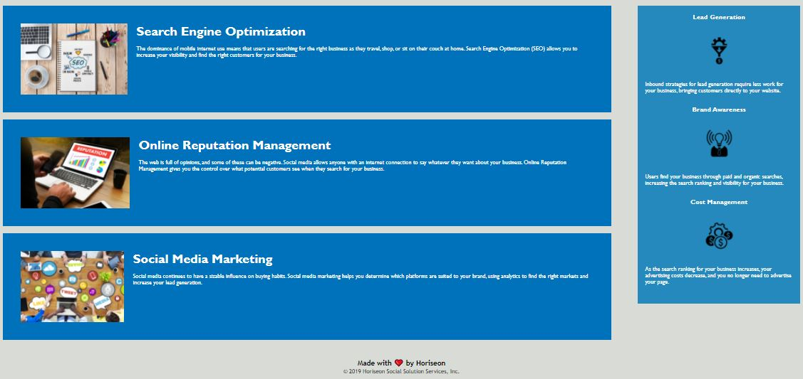

# code-refactor

In this project, I refactored a website to meet accessibility standards, without changing the overall look or content of the website. I first researched accessibility standards to determine what is necessary to improve accessibility. I then reviewed the initial code and updated HTML elements to semantic HTML elements. I ensured HTML elements followed a logical structure. I also added alt attributes to the images provided for accessibility purposes. I followed a similar process to update the CSS file to consolidate and re-organize the styling content based on the semantic structure. Lastly, I deployed the updated site using GitHub, to be accessed using the link provided in the appropriate section below.

## Snapshot

## Built With

* [HTML](https://developer.mozilla.org/en-US/docs/Web/HTML) - to create elements
* [CSS](https://developer.mozilla.org/en-US/docs/Web/CSS) - to style the html elements
* [Visual Studio Code](https://code.visualstudio.com/) - to modify the code on my local device
* [Git](https://git-scm.com/) - to track changes and push commits
* [GitHub](github.com) - to host the repository and deploy with GitHub pages

## Deployed Link

* [https://kiri-smith.github.io/code-refactor/](#)

## Author

* Kiri Smith 

- [https://kiri-smith.github.io/](#)
- [https://github.com/kiri-smith](https://github.com/)
- [https://www.linkedin.com/in/kiri-lynne-smith/](https://www.linkedin.com/)

## License

This project is licensed under the MIT License.

## Acknowledgments

* Jerome Chenette: the creator of the initial Horiseon site
* My peers for answering questions to clarify the requirements of this first assignment
